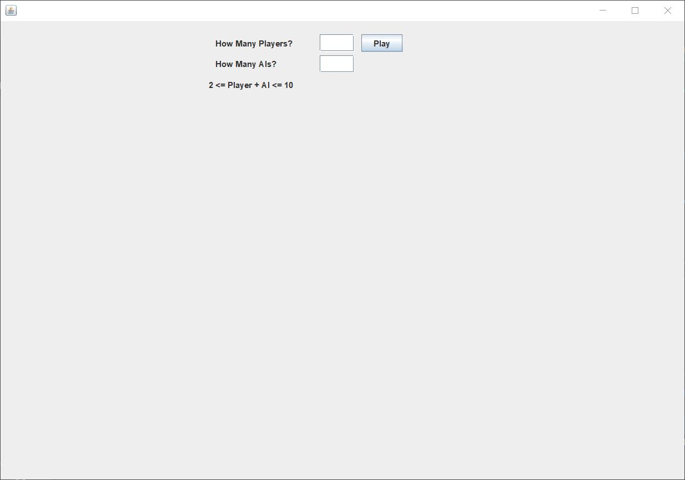
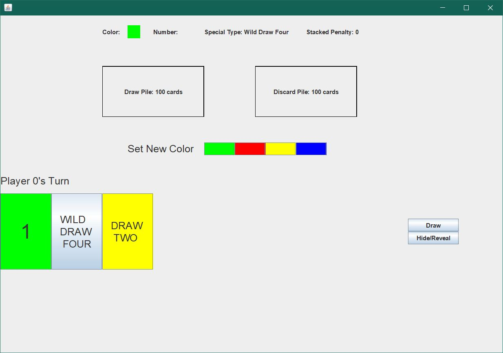
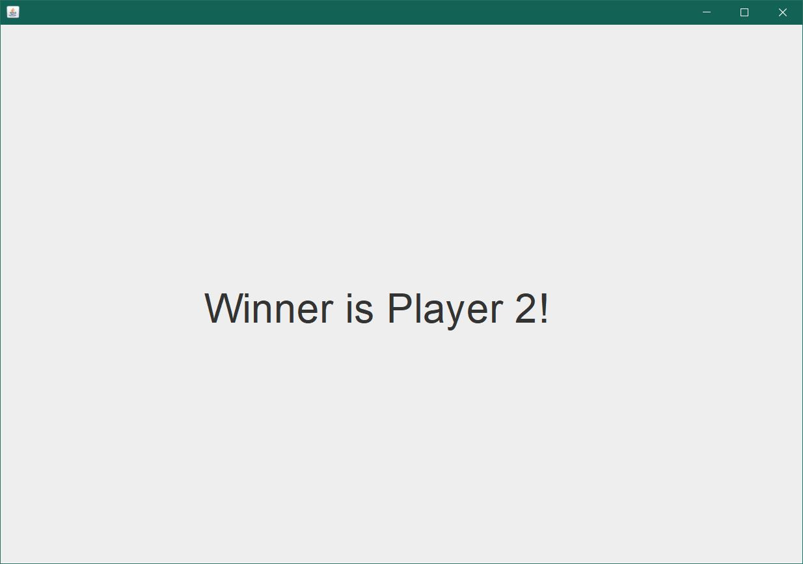

##Manual Test Plan
###Prerequisites
Intellij IDEA 
Java SE Development Kit 12 or above
###Environment Setup and configurations
Open the project on Intellij.
Navigate to src/unocontroller/Main.java. 
Click on the Run button on the left of the main function to run the GUI.
###Operations and Results
1. The first frame is the start scene where users should enter the number of players and the number of AIs.   
    * The number of players plus the number of AIs should be greater than 1 and less than 11.
    * Enter two numbers whose sum is between 2 to 10 and click the Play button. 
      The game should automatically switch to the game scene. 
    * Enter two number whose sum less than 2 or greater than 10. The game should not proceed to the game scene. 
      An error message will be displayed and ask for another input. 
2. The second frame is the main game scene where players can see the game state and make moves.   
    * Click on the Draw button. A new card will be added to the hand cards and displayed at the bottom.
    * Click on Hide/Reveal button. The hand cards of the current player should be hided or revealed. 
    * The current game state is on the top. Try to click on any cards that matches one of the game states(color, number, special type).
      The game should proceed to the next player. 
    * Click on any card that does not match any of the game states. 
      The game should reject the card. An error message should be displayed and ask the player to select another card. 
    * Play out a valid number card(e.g. Green 1). The color and number should be updated 
      to the card that is played, and special type should display nothing. 
    * Play out a special card. The current color and special type should be updated and current number should display nothing.
      The special effect of the card should be applied by the followings:
        * Reverse: switch direction
        * Skip: next player is skipped
        * Draw two: The stacked penalty should plus 2, and the next player should draw that number of cards if he/she has no draw two cards. 
        * Wild: The set new color panel should be displayed and allow player to click on one of the colors. 
                The current color should be changed accordingly. After the player select a color, the game will proceed.
        * Wild draw four: The player should be able to change color, and the penalty should plus 4. 
          The next play should draw that number of cards if he/she has no wild draw four. 
    * Play out a draw two. On the next player's round, click on any card other than a draw two. The game will not proceed. 
      Play out a draw two. The penalty should be stacked to 4.
    * Play out a wild draw four. On the next player's round, click on any card other than a wild draw four. The game should not proceed.
      Play out a wild draw four on the next player's round. The penalty should be stacked to 8.
    * Start and play a game until the draw pile is exhausted. When the draw pile number gets to 0 and someone try to draw a card, 
      the draw pile number should be equal to the discard pile number and the new discard pile number should be 0, 
      which means cards in discard pile are reused.
3. The third frame is the winner scene.    
    * Start and play a game until some player has no hand card, then he/she should be the winner and the game will switch to the winner scene. 
      The winner's index will be displayed on this scene. 
### Test the Game Model
Navigate to ./src/unotest. There are four folders with tests for Card, Pile, Player and Server. Run them and see the result. 
